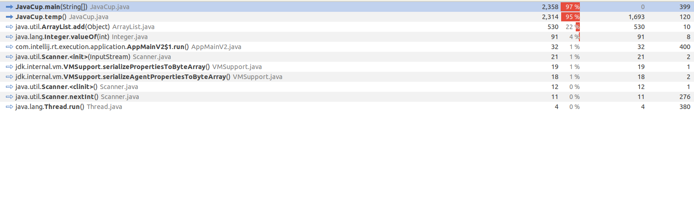
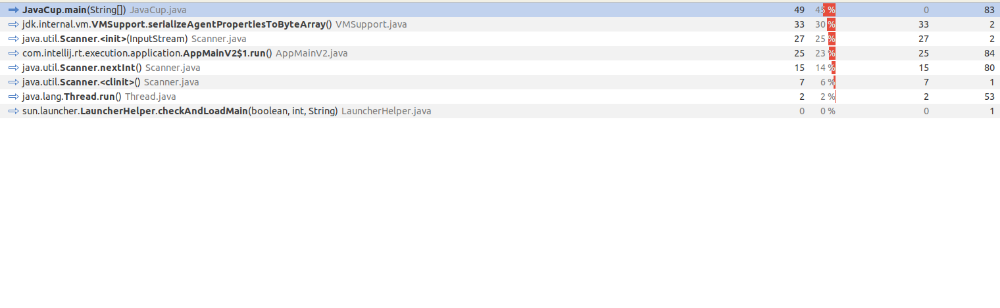

#  پروژه JavaCup

پروژه JavaCup یک برنامه ساده به زبان Java است که ورودی سه عدد از کاربر می‌گیرد و بررسی می‌کند آیا این سه عدد می‌توانند اضلاع یک مثلث قائم‌الزاویه باشند یا نه. علاوه‌براین، دارای یک متد تستی (`temp`) برای ایجاد بار پردازشی سنگین روی سیستم است.

---

##  ساختار کد

### 🔹 `main(String[] args)`
- دریافت ۳ عدد از کاربر با استفاده از `Scanner`
- اجرای متد `temp()` برای شبیه‌سازی بار پردازشی
- فراخوانی متد `eval(i, j, k)` برای بررسی فیثاغورثی بودن اعداد

### 🔹 `eval(int i, int j, int k)`
بررسی می‌کند که آیا این اعداد رابطه فیثاغورث را برقرار می‌کنند یا نه:
```java
if (i² + j² == k² || i² == j² + k² || j² == i² + k²)
```

### 🔹 `temp()`
متدی آزمایشی است که در آن از دو حلقه تو در تو استفاده شده است:
```java
ArrayList a = new ArrayList();
for (int i = 0; i < 10000; i++) {
    for (int j = 0; j < 20000; j++) {
        a.add(i + j);
    }
}
```

---

## ⚠️ بخش پرمصرف: `temp()`

بخش `temp()` عامل اصلی مصرف منابع در برنامه است. دلایل آن به شرح زیر است:

### ❗ چرا temp() مصرف زیادی دارد؟

1. **حلقه‌های بسیار بزرگ**:
   - اجرای ۱۰٬۰۰۰ × ۲۰٬۰۰۰ = ۲۰۰ میلیون تکرار

2. **استفاده از `ArrayList` بدون ظرفیت اولیه**:
   - باعث تخصیص مکرر حافظه (resize) و کندی برنامه می‌شود.

3. **Boxing نوع داده‌ها**:
   - مقدار `i + j` به‌صورت `int` محاسبه می‌شود اما باید به `Integer` تبدیل شود تا در `ArrayList` ذخیره شود (boxing).

4. **افزایش شدید مصرف حافظه**:
   - ذخیره ۲۰۰ میلیون مقدار به‌صورت `Integer` باعث مصرف بسیار بالای RAM می‌شود.

---

## 💡 راهکارهای پیشنهادی برای بهینه‌سازی

✅ **۱. استفاده از ظرفیت اولیه در ArrayList**  
با تعیین ظرفیت اولیه، عملیات resize حذف می‌شود:
```java
ArrayList<Integer> a = new ArrayList<>(200_000_000);
```

---

✅ **۲. استفاده از آرایه ساده (`int[]`) به‌جای `ArrayList`**  
باعث حذف boxing و افزایش کارایی می‌شود:
```java
int[] a = new int[200_000_000];
int index = 0;
for (int i = 0; i < 10000; i++) {
    for (int j = 0; j < 20000; j++) {
        a[index++] = i + j;
    }
}
```


---

## ✅ نتیجه‌گیری

در این پروژه، متد `temp()` به‌تنهایی بیش از ۹۰٪ زمان و منابع پردازشی را مصرف می‌کند. با ساده‌ترین بهینه‌سازی‌ها مثل استفاده از آرایه یا تعیین ظرفیت اولیه، می‌توان مصرف منابع را تا چند برابر کاهش داد و کارایی را به‌طور چشم‌گیر افزایش داد.

---

---

## ✅ عکس ها
عکس قبل 



عکس بعد

---


